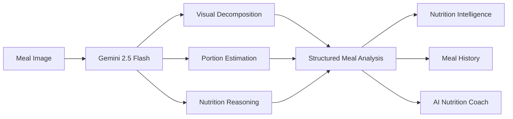

# NutriScan

AI-powered meal analysis, nutrition insights, and personalized dietary coaching using Gemini Vision.

## Overview

NutriScan explores how multimodal AI can replace traditional food-classification pipelines by reasoning directly about meals, nutritional composition, and dietary patterns from a single image.

Users can upload a meal photo, receive structured nutritional insights, track eating habits, and interact with an AI coach grounded in their meal history.

---

## System Architecture



---

## Screenshots

### Meal Analysis


### Meal History


### Nutrition Coach


---

## Features

* Meal recognition from images
* Portion-size estimation
* Nutrition and health scoring
* Dietary flag detection
* Behavioral nutrition insights
* Historical meal tracking
* AI-powered nutrition coaching

---

## Tech Stack

| Layer     | Technology          |
| --------- | ------------------- |
| Frontend  | React, Tailwind CSS |
| Backend   | Node.js, Express    |
| AI        | Gemini 2.5 Flash    |
| Animation | Framer Motion       |
| Language  | TypeScript          |

---

## Setup

```bash
git clone <repository-url>
cd nutriscan

npm install
npm run dev
```

Create a `.env` file:

```env
GEMINI_API_KEY=your_api_key
```

---

## Future Roadmap

* Daily nutrition dashboard
* Long-term dietary analytics
* Smart meal planning
* Grocery recommendations
* Wearable integrations

---

## Known Limitations

* Nutrition values are estimates and depend on image quality.
* Portion-size estimation remains an approximation.
* Results should not be considered medical advice.

```
```
