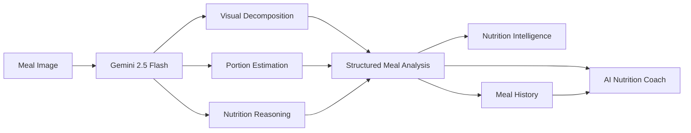
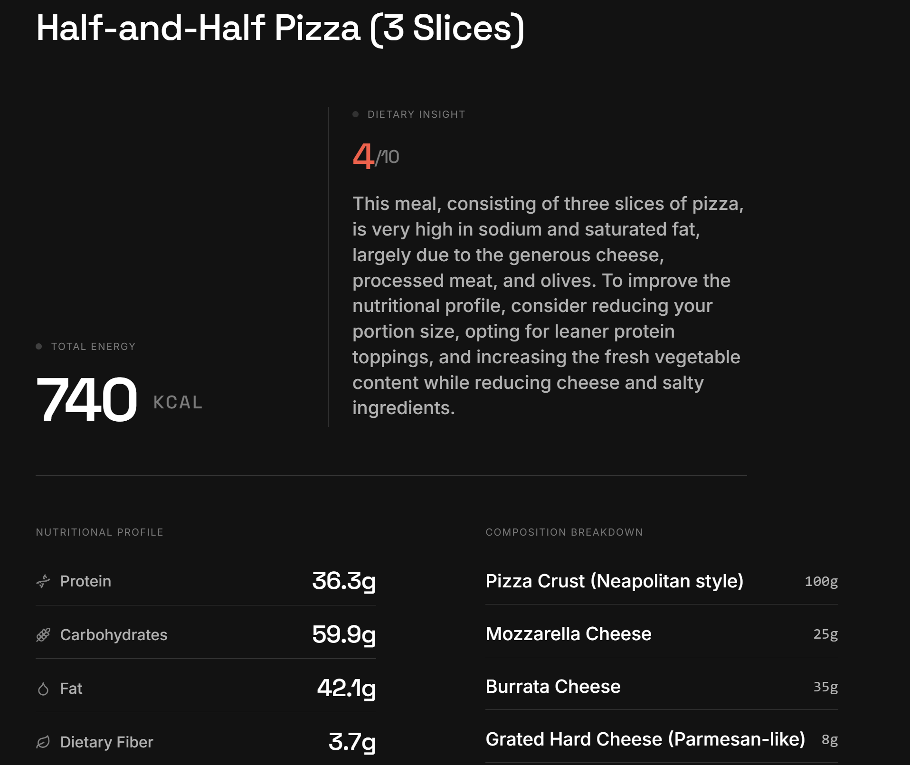

# NutriScan

NutriScan explores how modern multimodal AI models can replace traditional food-classification pipelines by reasoning directly about meals, nutritional composition, and dietary patterns from a single image.

---

## Overview

Most nutrition tracking applications depend on manual food logging, creating friction that often leads to inconsistent usage and incomplete dietary records.

NutriScan combines computer vision and multimodal AI to analyze meal images, estimate nutritional values, identify behavioral patterns, and provide personalized coaching. Rather than focusing solely on calorie counting, the platform emphasizes long-term nutritional awareness and habit formation.

---

## Why NutriScan?

Traditional food-analysis systems rely on predefined food categories and external nutrition databases.

NutriScan takes a different approach:

* Understands meals directly from images using multimodal AI
* Estimates nutritional composition without rigid food taxonomies
* Tracks dietary patterns across time rather than isolated meals
* Provides contextual coaching based on historical behavior
* Uses structured AI outputs to transform image understanding into actionable nutrition intelligence

---

## System Architecture



---

## Core Capabilities

### Meal Understanding

Upload a meal image and receive:

* Food identification
* Portion-size estimation
* Macronutrient breakdown
* Micronutrient estimates
* Dietary classification
* Health scoring

### Context-Aware Analysis

Users can optionally provide additional context such as:

* Homemade preparation
* Added ingredients
* Cooking method
* Portion adjustments

This information is incorporated into the analysis process alongside image understanding.

### Nutrition Intelligence

The platform evaluates:

* Meal balance
* Protein adequacy
* Fiber intake
* Sodium exposure
* Sugar consumption
* Nutritional quality

### Behavioral Insights

NutriScan focuses on long-term dietary behavior by surfacing:

* Consistency trends
* Nutritional blind spots
* Strongest habits
* Areas for improvement

### Nutrition Coach

A conversational coaching system that:

* References previous meals
* Identifies recurring patterns
* Suggests practical improvements
* Adapts recommendations to user goals

---

## Screenshots

### Meal Analysis


*Image upload and analysis processing screen.*



*Detailed nutrition breakdown, composition analysis, and dietary insight.*

### Meal History


*Chronological meal tracking focused on identifying recurring nutritional patterns.*

### Nutrition Coach


*Context-aware coaching grounded in historical meal behavior and user goals.*

---

## Technology Stack

| Layer     | Technology          | Purpose                 |
| --------- | ------------------- | ----------------------- |
| Frontend  | React, Tailwind CSS | User Interface          |
| Backend   | Node.js, Express    | API Layer               |
| AI Vision | Gemini 2.5 Flash    | Meal Analysis           |
| AI Coach  | Gemini 2.5 Flash    | Conversational Guidance |
| Animation | Framer Motion       | Interface Motion        |
| Language  | TypeScript          | Type Safety             |

---

## Setup

### 1. Clone the Repository

```bash
git clone <repository-url>
cd nutriscan
```

### 2. Configure Environment Variables

Create a `.env` file in the project root:

```env
GEMINI_API_KEY=your_api_key
```

### 3. Install Dependencies

```bash
npm install
```

### 4. Start the Development Server

```bash
npm run dev
```

---

## API Reference

### POST `/api/analyze-v2`

Analyzes a meal image and returns structured nutritional insights.

**Request**

* `file` (required)
* `context` (optional)
* `user_profile` (optional)

**Response**

Structured meal analysis containing:

* Nutritional estimates
* Macronutrient breakdown
* Dietary flags
* Health score
* Recommendations
* Ingredient-level reasoning

---

## Design Decisions

### Direct Multimodal Analysis

**Context**

Traditional food classifiers depend on predefined food dictionaries and category limits.

**Decision**

Use Gemini Vision to reason directly about meals and generate structured nutritional outputs.

**Tradeoff**

Higher inference cost and latency in exchange for broader food coverage.

---

### Behavioral Analytics Over Meal Tracking

**Context**

Single-meal reports provide limited long-term value.

**Decision**

Prioritize recurring dietary patterns and trends over isolated calorie estimates.

**Tradeoff**

Meaningful insights require historical meal data before patterns become visible.

---

### Conversational Coaching

**Context**

Static nutrition reports are often reviewed once and ignored.

**Decision**

Provide an interactive coaching layer grounded in historical meal behavior.

**Tradeoff**

Requires additional context management and AI inference calls.

---

## Future Roadmap

### Daily Nutrition Dashboard

Track:

* Daily calorie targets
* Macro adherence
* Meal completion
* Nutrition score summaries

### Longitudinal Analytics

Analyze dietary trends across weeks and months:

* Protein consistency
* Fiber intake progression
* Sodium exposure trends
* Meal quality evolution
* Behavioral adherence scoring

### Smart Meal Planning

Generate meal suggestions based on:

* Historical behavior
* Nutrition goals
* Recurring deficiencies
* Preferred cuisines

---

## Known Limitations

1. Nutritional values are estimates and depend heavily on image quality.
2. Portion-size estimation remains challenging without depth information.
3. Analysis results should not be interpreted as medical advice.
4. AI inference costs scale with usage volume and image complexity.

---

